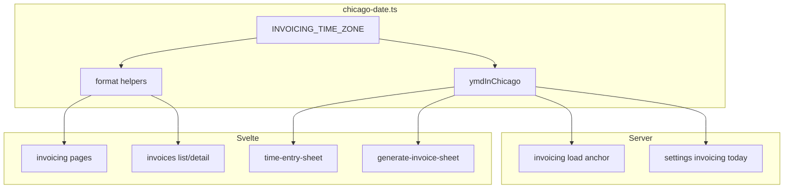

# Invoicing: Chicago everywhere + Save and New

## Requirement (updated)

**America/Chicago** is the default for **every** invoicing touchpoint: server “today,” new/edit time entry default date, generate-draft period defaults, and **all** user-visible date/datetime formatting in invoicing routes and related components. Do not rely on `undefined`/`toISOString().slice(0,10)`/host UTC for user-facing calendar semantics.

DB continues to store `date` as `YYYY-MM-DD` (civil) and timestamps as ISO instants; only **interpretation and display** standardize on Chicago.

## Root causes

- [`src/lib/components/time-entry-sheet.svelte`](src/lib/components/time-entry-sheet.svelte) uses `toISOString().slice(0, 10)` → **UTC** calendar date.
- Server [`todayYMD()`](src/routes/invoicing/+page.server.ts) / settings invoicing use `getFullYear()` etc. on `new Date()` → **host** (often UTC on Vercel).
- [`src/lib/components/generate-invoice-sheet.svelte`](src/lib/components/generate-invoice-sheet.svelte) derives periods from `new Date()` + local getters → browser local TZ, not guaranteed Chicago.
- Multiple `.svelte` files use `toLocaleDateString(undefined, …)` or `toLocaleString()` → **browser local**; invoice detail [`fmtTs`](src/routes/invoicing/invoices/[id]/+page.svelte) is local, not Chicago.

## 1) Shared module

Add **[`src/lib/invoicing/chicago-date.ts`](src/lib/invoicing/chicago-date.ts)** exporting:

- `INVOICING_TIME_ZONE = 'America/Chicago'`.
- `ymdInChicago(isoInstant?: Date): string` — civil date via `Intl.DateTimeFormat` + `formatToParts` for the named zone.
- Display helpers used by pages (avoid duplicating options):
  - Format a `YYYY-MM-DD` string for long/short labels with `timeZone: INVOICING_TIME_ZONE`.
  - `formatInstantInChicago(iso: string, options)` for `sent_at` / `paid_at` / similar (`Intl` with explicit zone instead of `toLocaleString()` with no zone).

## 2) Server

| File | Change |
|------|--------|
| [`src/routes/invoicing/+page.server.ts`](src/routes/invoicing/+page.server.ts) | Default `anchor` when `?date=` missing: `ymdInChicago()` instead of `todayYMD()`. |
| [`src/routes/settings/invoicing/+page.server.ts`](src/routes/settings/invoicing/+page.server.ts) | `today` for active-rate logic: `ymdInChicago()`. |

`dayBefore` in settings server uses `new Date(y, m-1, d)` for civil arithmetic — acceptable if inputs are already Chicago-semantic YMDs; no change unless bugs appear.

## 3) All invoicing UI (required)

Pass `timeZone: INVOICING_TIME_ZONE` (and keep `en-US` or current locale) everywhere invoicing shows dates to the user:

| File | Notes |
|------|--------|
| [`src/routes/invoicing/+page.svelte`](src/routes/invoicing/+page.svelte) | `periodLabel`, `fmtShort`, `formatDayHeader` — replace `toLocaleDateString(undefined, …)` with Chicago (shared helper or inline `timeZone`). |
| [`src/routes/invoicing/invoices/+page.svelte`](src/routes/invoicing/invoices/+page.svelte) | Invoice list period formatting. |
| [`src/routes/invoicing/invoices/[id]/+page.svelte`](src/routes/invoicing/invoices/[id]/+page.svelte) | `formatPeriod`, `fmtLong`, and **`fmtTs`** for ISO timestamps. |

## 4) Generate invoice sheet

[`src/lib/components/generate-invoice-sheet.svelte`](src/lib/components/generate-invoice-sheet.svelte): Replace “today” and week/month default paths that use `new Date()` + `getFullYear`/`getMonth`/`getDate` with **`ymdInChicago()`** and civil-date arithmetic derived from that YMD (or small helpers next to the module), including `previousWeekMonSun`, `defaultMonthToDate`, and fallbacks in `monthSpanFromBounds`, so defaults match Chicago even when the machine/browser is elsewhere.

## 5) Time entry sheet + action (unchanged intent)

- Default create `dateStr`: `ymdInChicago()`.
- **Save and New**: `intent` submit values; `create` action returns `{ success, saveAndNew, savedDate }` when applicable.
- **`use:enhance`**: branch keeps sheet open and applies partial reset.
- **Init effect**: only on sheet **closed → open** transition (`wasOpen` pattern) so `update()` after save does not wipe state.

Primary Save keeps `hotkey="s"`; secondary outline button without hotkey.

## 6) Out of scope / explicit non-goals

- **Audit log / settings outside invoicing** — unchanged unless they surface invoicing-only labels (then reuse helper).
- **Storing** `paid_at` / `sent_at` — remain ISO; only **display** uses Chicago.

## 7) Verification

- `npm run check`.
- New time entry default date matches Chicago, not UTC evening offset.
- `/invoicing` default period anchor matches Chicago “today” when no `date` param.
- Invoice list/detail and timestamps read as Chicago while system TZ differs (simulate or spot-check).
- Generate invoice defaults (TWHealth previous week, month-to-date, etc.) align with Chicago calendar.
- Save and New keeps sheet open and date = last saved.

