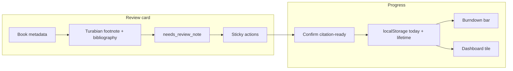

# Turabian-First Review Queue

## Tracker alignment

| Concept | Where it lives |
| --- | --- |
| **Canonical spec** | This file — linked from [`docs/POS_Library_Build_Tracker.md`](docs/POS_Library_Build_Tracker.md) Session 8 + Session 8.5 |
| **Post-trip session order** | **7 → 9 → 8** (Settings → OCR → Turabian). Book-level review cards **depend on Session 8’s `turabian/` module**, not on Session 9 OCR. |
| **Session 8** | Citation module **plus** Turabian-first `/library/review` (must-ship for September checkpoint). |
| **Session 8.5** | Optional polish (~2h): swipe, haptic + checkmark animation, microcopy — same spec; move here if Session 8 timeline is tight. |

There is **no** Session 10 in the tracker; earlier drafts used that label — **Session 8 / 8.5** are the correct slots.

## What this plan is now

Not gamification of metadata cleanup. The review queue **is** the surface where the September Turabian checkpoint gets verified, one book at a time, on the phone. The "game" is watching the citation-verified denominator fill up against the scholarly core.

This reframes phone-first UX (short loops, visible progress) around the work that actually has a hard deadline.

## Card content (the product)

The review card renders, in this order:

1. **Book metadata** — title, authors with roles, year, edition, series + volume, publisher (compact display, not the full edit form).
2. **Generated Turabian footnote** — produced by the citation module from **Session 8**. Rendered in a monospace block with a Copy button.
3. **Generated bibliography entry** — same module, same render pattern.
4. **`needs_review_note`** — why this book was flagged at import. Plain text, prominent. If null, hide the row.
5. **Coverage hints** — count of `scripture_references` and `book_topics` rows attached, if any. (Doesn't block confirmation; signals "this book has research notes attached" so the user knows it matters.)

### Actions (sticky bottom bar)

| Action | Effect | Hotkey |
| --- | --- | --- |
| **Confirm citation-ready** (primary) | Sets `needs_review = false`, clears `needs_review_note`, advances queue | `s` (preserves existing convention) |
| **Field is wrong** (secondary) | Opens edit flow pre-focused; user picks which field; on save, returns to review with `needs_review` still true | `e` (new — add to [`hotkeys.mdc`](.cursor/rules/hotkeys.mdc) / registry when implemented) |
| **Skip** (tertiary) | No DB write; advances queue; not counted toward today's progress | Prefer existing **Esc** / outline Skip unless `k` is registered |
| **Delete / Edit full** (overflow) | Existing destructive paths, behind confirm | unchanged |

Reconcile skip hotkey with current `/library/review` (today: **Esc** + Skip button with `hotkey="Escape"`). If adopting `k`, register in [`src/lib/hotkeys/registry.ts`](src/lib/hotkeys/registry.ts) first.

## Two queues, deadline-gated

| Slice | Scope | Default | Why |
| --- | --- | --- | --- |
| **Citation Critical** | `genre IN (commentary, bibles, biblical reference, * language tools)` AND `needs_review = true` | Default until Sept 1, 2026 | The September seminary deadline. ~265 scholarly core books. |
| **Backlog** | `needs_review = true` AND not in scholarly core | Default Sept 1 onward | The ~1,020 no-subject books. Phone-friendly, low stakes. |

Date check is client-side on first slice load; user can override via slice pills at any time. Don't hard-block the user from working backlog before Sept 1 — just don't put them there by default.

## Progress UI (no streaks)

Header on `/library/review`:

```
[ Citation Critical ▾ ]      Today: 7      ███████░░░ 184 / 265
```

- `Today: N` resets at local midnight (date-stamped in localStorage).
- Burndown bar = `(total_in_slice - remaining_in_slice) / total_in_slice`.
- No daily goal target. No "5 to go" guilt copy. Motivation comes from a visible denominator and forward motion, not streak anxiety.
- Backlog slice swaps the denominator: `Y / 1,020`.

### Why no streaks

Kolbe profile is 7-2-8-4. Follow Thru is the lowest, and Follow Thru is precisely what streaks measure. A streak built across a busy seminary week is a guilt mechanic regardless of "freeze token" softening — the broken streak is still surfaced. A burndown is recoverable: a week off doesn't reset the denominator.

## Persistence

**localStorage only.** Schema additions for server-side stats are deferred indefinitely. Single-user, single-device review surface — no cross-device sync requirement.

Keys (mirroring [`scan-session.ts`](src/lib/library/scan-session.ts) pattern):

- `library.review.lifetime_cleared` — number
- `library.review.today` — `{ date: 'YYYY-MM-DD', count: number }`
- `library.review.last_slice` — string

Increment from the client after `reviewSaveAction` returns success.

## Mobile UX

| Gap | Direction |
| --- | --- |
| Actions live mid-card | Sticky bottom bar (see Actions above). Card scrolls under it. |
| Desktop kbd hints on phone | Hide kbd row below `md:`. |
| Cognitive load | Subtle "Card 3 · 184 left in slice" strip under header. No peek-of-next stack — adds visual noise without buying speed. |
| Speed | Right swipe = Confirm (when confirmable); left swipe = Skip. Pointer capture, ~80px threshold. Field-wrong stays button-only. **Session 8.5** if deferred from Session 8. |

## Feedback

- Haptic: `navigator.vibrate(15)` on Confirm success where supported.
- Visual: 200ms CSS checkmark fade-in over the action area, then card advance.
- No confetti, no sound, no level-up modals. The denominator advancing is the celebration.

(Session 8.5 if bundled with swipe.)

## Dashboard tile extension

Library tile gets a second line:

```
1,288 books · 184 / 265 citation-verified
```

After Sept 1, swap to:

```
1,288 books · 412 / 1,020 backlog cleared
```

Deep link: `/library/review?slice=critical` or `?slice=backlog`.

## Scope fences

- **Out:** server-backed stats, streaks, XP, daily goal targets, sprint timer, confetti, leaderboards.
- **Out:** OCR / image upload triggering review (post-August per PostBuild optimization docs).
- **Out:** review of viewer-edited books vs owner-edited books (no per-actor filtering for August).

## Citation-module coordination

- **Session 9** may add a **scripture-reference** “needs review” queue — distinct from **books** `/library/review`. Use clear UI labels (“Books” vs “Scripture refs”) when both exist.
- Review cards consume the **same** `turabian/` formatters as book detail Copy buttons — one module, two surfaces (Session 8).

## Ethics check

- No comparative shame ("you reviewed 3 yesterday and 1 today").
- No daily goal that creates failure on miss.
- No streak that resets.
- Positive framing only: "184 verified" not "81 to go."
- Skip is a first-class action, not punished.


